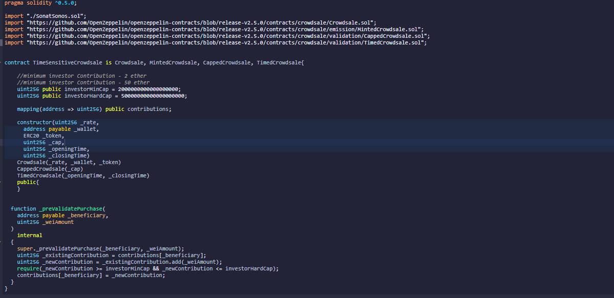

# Project 3: Sonat Sonos Token
This contract is designed to promote exclusive event experiences within the Puget Sound region.  Local event promoters work with artists to provide event seekers a unique VIP experience to see concerts, art exhibits and attractions, just to name a few.  The tokens issued through the contract allow the user to build an exciting experience that includes the event, food and beverages, and even transportation.  When tokens are not used, the funding is returned to the event promoters along with a portion going to the artists.

---

## Technologies

* [Solidity](https://docs.soliditylang.org/en/v0.8.9/) - Solidity is an object-oriented, high-level language for implementing smart contracts. Smart contracts are programs which govern the behaviour of accounts within the Ethereum state.

* [Remix IDE](https://remix-ide.readthedocs.io/en/latest/) - For the entire journey of contract development as well as being a playground for learning and teaching Ethereum.

* [Unix Time Stamp](https://www.unixtimestamp.com/index.php) - For tracking time as a running total of seconds. This count starts at the Unix Epoch on January 1st, 1970 at UTC.

* [MetaMask](https://docs.metamask.io/guide/) - For secure and usable Ethereum-based web sites. In particular, it handles account management and connecting the user to the blockchain.

* [Ganache](https://www.trufflesuite.com) - For quickly firing up a personal Ethereum blockchain which can be used to run tests, execute commands, and inspect state while controlling how the chain operates.

* [OpenZeppelin](https://docs.openzeppelin.com/openzeppelin/) - OpenZeppelin provides security products to build, automate, and operate decentralized applications.

* [Vecteezy](https://www.vecteezy.com/) - High quality images created by the world's most talented design community. Find and download high quality vector graphics with worry-free licensing.

---

## Installation Guide

To run this contract, clone this repository and run the 'SonatSonos.sol' and 'Time_Sensitive.sol' files on your computer in the Remix IDE. 

---

## Examples

The images below are examples of what the 'SonatSonos.sol' and 'Time_Sensitive.sol' files will display when they are run in Remix IDE and MetaMask.

SonatSonos.sol:

Time_Sensitive.sol:

Unix Time Stamp Conversion:

---

## Contributors

Alissa Bolla
Andrew McKay III

---

## License

MIT
